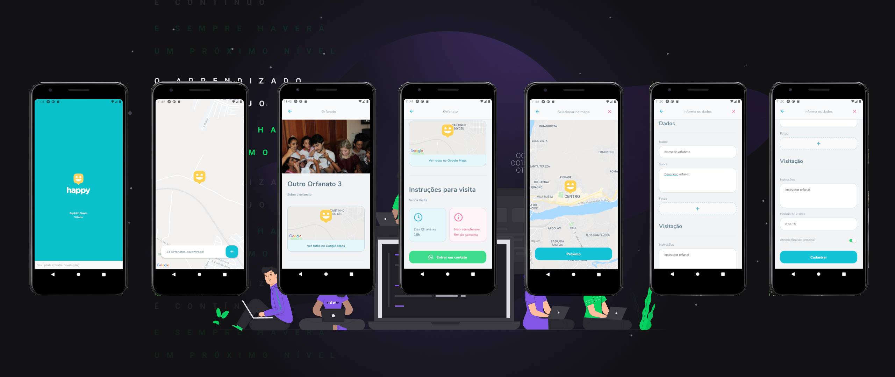

# MOBILE HAPPY

Interface de uma loja virtual feito com REACT NATIVE. 

Repositório com o código fonte do aplicativo. 

Na página inicial do Aplicativo, ele pode ver quais Orfanatos tem cadastrado na sua região. E cliencando em cima do icone do Orfanato, vai mostrar o nome, e clicadno em cima do nome. Ele pode ver os detalhes do orfanato.

Clicando no botão de inclusão, primeiro o usuário terá que clicar no mapa, para selecionar a latitude e a longitude. Após isso, clicando no botão cadastrar, será direcionado para a pagina com o formulário. Onde ele pode colocar o máximo de dados, e também incluir fotos.

Este projeto utiliza o [Expo](https://expo.io/). A versão do `expo-cli` usado foi a `3.24.2`
---
# 📱 App
## App Desenvolvida em:
    React Native
---
## Dependências: 

    "axios": "^0.20.0",
    "expo": "~39.0.2",
    "expo-font": "~8.3.0",
    "expo-image-picker": "~9.1.0",
    "react-native-gesture-handler": "~1.7.0",
    "react-native-maps": "0.27.1",
    "react-native-reanimated": "~1.13.0",
    "react-native-safe-area-context": "3.1.4",
    "react-native-screens": "~2.10.1",
---
## Instalação

Você precisará ter apenas o [NodeJS](https://nodejs.org) instalado na sua máquina, e após isso, clonar este repositório:
```sh
  $ git clone https://github.com/giljrsantos/nlw-3-mobile-.git
```

Depois disso acesse a pasta da aula que você deseja e instale as dependências executando o seguinte comando:
```sh
  $ yarn add # ou npm install
```
---
## Executando a aplicação

Execute o comando a baixo para inicializar o Expo:
```sh
  $ yarn start # ou npm start
```
---
Agora basta abrir o emulador pelo seu computador, ou o aplicativo do Expo no seu celular (disponível na [App Store](https://apps.apple.com/br/app/expo-client/id982107779) e na [Google Play](https://play.google.com/store/apps/details?id=host.exp.exponent&hl=pt_BR)).

---

# 📱 ScreenShot App
<p align="center">

</p>
<h1 align="center">💻 Desenvolvido Por: Gilberto Júnior</h1>
